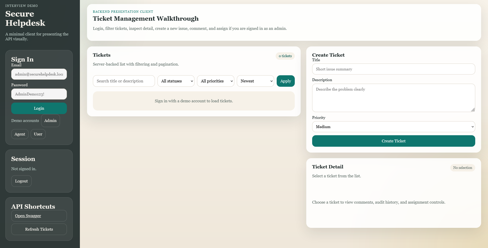

# Secure Helpdesk API

Secure Helpdesk API is a production-minded ASP.NET Core Web API portfolio project for managing internal support tickets. It demonstrates secure authentication, role-based authorization, ticket workflows, comments, audit history, filtering, pagination, seeding, structured logging, and clean API design.

This project is designed to align with .NET backend/software engineering roles by showing practical architecture choices rather than unnecessary complexity.

## Overview

The API models a small internal helpdesk platform with three roles:

- `Admin`: full visibility and ticket assignment rights
- `Agent`: manages tickets assigned to them
- `User`: creates tickets and tracks their own issues

The system includes:

- JWT authentication with ASP.NET Core Identity
- ticket creation and lifecycle management
- ticket comments
- audit logging for important workflow changes
- standardized validation and error responses
- Swagger/OpenAPI documentation
- seeded demo data for local development

## Key Features

- Secure registration and login using ASP.NET Core Identity and JWT
- Role-based access control for `Admin`, `Agent`, and `User`
- Ticket CRUD-style workflow endpoints with sensible status transitions
- Comments and audit history on ticket detail responses
- Filtering by status, priority, assignee, creator, and keyword search
- Pagination and sorting for list endpoints
- SQL Server + Entity Framework Core persistence
- Consistent DTO-based API contracts
- Centralized error handling and validation responses
- Structured request and business-event logging
- Demo-ready Swagger UI with JWT support and example payloads

## Architecture Summary

The solution uses a pragmatic layered architecture:

- `src/SecureHelpdesk.Api`
  - HTTP layer: controllers, middleware, Swagger, logging, startup configuration
- `src/SecureHelpdesk.Application`
  - application layer: DTOs, interfaces, service logic, mappings, shared API concerns
- `src/SecureHelpdesk.Domain`
  - domain layer: entities, enums, constants
- `src/SecureHelpdesk.Infrastructure`
  - infrastructure layer: EF Core, Identity, JWT token generation, repositories, seeding
- `tests/SecureHelpdesk.Tests`
  - focused unit and lightweight integration-style tests

This keeps controllers thin, business logic in services, and persistence concerns in repositories/EF Core.

## Tech Stack

- .NET 8
- ASP.NET Core Web API
- Entity Framework Core
- SQL Server
- ASP.NET Core Identity
- JWT bearer authentication
- Swagger / OpenAPI via Swashbuckle
- xUnit + Moq
- ASP.NET Core integration testing via `WebApplicationFactory`
- SQLite in-memory for lightweight service tests
- GitHub Actions CI
- Docker / docker-compose

## Authentication and Roles

Authentication uses JWT bearer tokens generated after registration or login.

Role model:

- `Admin`
  - full ticket visibility
  - can assign tickets
  - can update ticket details and status
- `Agent`
  - can manage tickets assigned to them
  - can update ticket details and status for assigned tickets
  - can comment on visible tickets
- `User`
  - can create tickets
  - can view their own tickets
  - can comment on tickets they can access

Swagger supports JWT testing directly through the `Authorize` button.

## Database Setup

Primary persistence is SQL Server using Entity Framework Core.

Default local connection string:

```json
"DefaultConnection": "Server=(localdb)\\MSSQLLocalDB;Database=SecureHelpdeskDb;Trusted_Connection=True;MultipleActiveResultSets=true;TrustServerCertificate=True"
```

The app will:

- use EF Core with SQL Server
- create/migrate the database on startup for local development
- seed demo data when enabled in configuration

## Configuration

Main configuration lives in:

- [`src/SecureHelpdesk.Api/appsettings.json`](./src/SecureHelpdesk.Api/appsettings.json)

Important sections:

- `ConnectionStrings`
- `Jwt`
- `DemoData`
- `Logging`

Example JWT settings:

```json
"Jwt": {
  "Issuer": "SecureHelpdesk.Api",
  "Audience": "SecureHelpdesk.Client",
  "SecretKey": "",
  "ExpirationMinutes": 60
}
```

Set the JWT secret through an environment variable or user secret:

```bash
$env:JWT_SECRET_KEY="ReplaceThisWithARealJwtSecretKeyAtLeast32Chars"
```

The application will fall back to `JWT_SECRET_KEY` when `Jwt:SecretKey` is blank.

## Running Locally

### Prerequisites

- .NET 8 SDK
- SQL Server LocalDB or SQL Server instance

### Steps

1. Clone the repository.
2. Review or update the SQL Server connection string in `src/SecureHelpdesk.Api/appsettings.json`.
3. Review JWT and `DemoData` settings.
4. Restore packages:

```bash
dotnet restore
```

5. Run the API:

```bash
dotnet user-secrets set "JWT_SECRET_KEY" "ReplaceThisWithARealJwtSecretKeyAtLeast32Chars" --project src/SecureHelpdesk.Api
dotnet run --project src/SecureHelpdesk.Api
```

6. Open the demo client or Swagger in development:

```text
http://localhost:5000/
http://localhost:5000/swagger
```

The development startup flow redirects `/` to the lightweight demo client.

## Health Check

The API exposes a basic health endpoint for operational readiness checks:

```text
GET /health
```

## Demo Credentials

The project seeds demo users for local development.

Default demo credentials from `appsettings.json`:

- Admin
  - `admin@securehelpdesk.local`
  - `AdminDemo123!`
- Agents
  - `agent1@securehelpdesk.local`
  - `AgentDemo123!`
  - `agent2@securehelpdesk.local`
  - `AgentDemo123!`
- Users
  - `user1@securehelpdesk.local`
  - `UserDemo123!`
  - `user2@securehelpdesk.local`
  - `UserDemo123!`
  - `user3@securehelpdesk.local`
  - `UserDemo123!`

These are intended for local demos only.

## API Documentation

Swagger/OpenAPI is configured to present well in interviews and demos:

- endpoint summaries and descriptions
- request/response schemas with examples
- JWT bearer auth support
- grouped endpoint tags
- standardized error response documentation

Suggested demo flow:

1. Login with the seeded admin account
2. Copy the JWT token into Swagger `Authorize`
3. List tickets
4. Open a ticket detail
5. Assign a ticket
6. Update ticket status
7. Add a comment

## Testing

Run the test suite with:

```bash
dotnet test tests/SecureHelpdesk.Tests/SecureHelpdesk.Tests.csproj
dotnet test tests/SecureHelpdesk.IntegrationTests/SecureHelpdesk.IntegrationTests.csproj
```

Current test coverage focuses on high-value service behaviors:

- auth service registration/login/profile behavior
- ticket creation
- assignment rules
- status transition rules
- validation/business-rule protection
- ticket query filtering/sorting behavior
- audit/comment side effects
- HTTP integration coverage for login, unauthorized access, role restrictions, and ticket creation

This is intentionally a focused suite rather than an overbuilt one.

## CI and Containers

The repository includes:

- GitHub Actions CI at `.github/workflows/ci.yml`
  - restore, build, and test on push/pull request
- `Dockerfile`
  - containerized API build and runtime image
- `docker-compose.yml`
  - API + SQL Server local container setup

Run with Docker:

```bash
docker compose up --build
```

## Sample Screenshots

### Demo Client

Minimal browser client for presenting the backend visually:



### Suggested Additional Screenshots

- `docs/screenshots/swagger-overview.png`
  - Swagger landing page with grouped endpoints
- `docs/screenshots/swagger-auth.png`
  - login endpoint and JWT authorize flow
- `docs/screenshots/swagger-ticket-detail.png`
  - ticket detail response showing comments and audit history
- `docs/screenshots/swagger-ticket-list.png`
  - paginated/filterable ticket list response

## Interview Talking Points

- Practical layered architecture with clear controller/service/repository boundaries
- Secure authentication using ASP.NET Core Identity and JWT instead of custom auth code
- Role-based authorization plus service-layer ownership checks
- Clean DTO contracts with no EF entity exposure from controllers
- Centralized validation and error handling with standardized JSON error responses
- Auditable ticket lifecycle with comments and structured audit logs
- Production-aware concerns such as logging, pagination, filtering, and seeding safety
- Swagger documentation polished for real API consumer experience
- Focused tests that prioritize business risk and regression prevention

## Future Improvements

- Refresh tokens and token revocation
- Email confirmation / password reset flows
- File attachments for tickets
- Integration tests using `WebApplicationFactory`
- Rate limiting and additional security hardening
- Full-text search for more advanced ticket searching
- Metrics/health checks for operational monitoring
- Docker support and CI pipeline setup
- Role/agent lookup endpoints for richer frontend workflows

## Project Fit

This project is intentionally scoped to feel realistic for a strong portfolio backend:

- not a toy CRUD app
- not overengineered with unnecessary patterns
- focused on secure, maintainable, interview-ready API design

It is a good representation of how an intermediate .NET developer might approach a small internal business API with production-quality habits.
